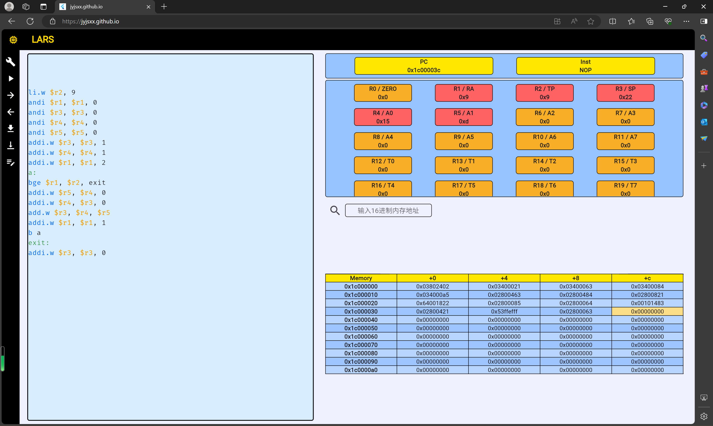
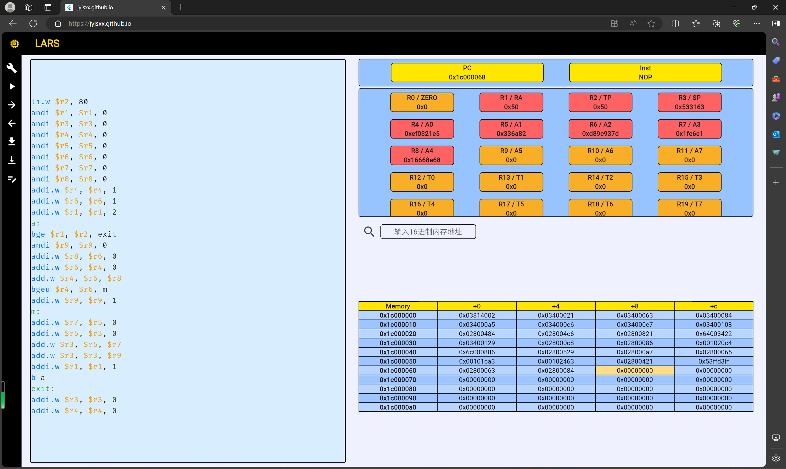
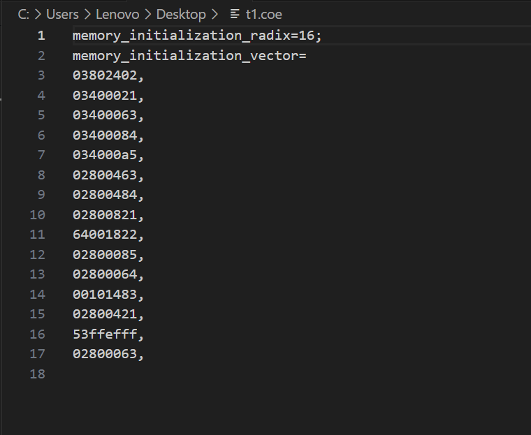
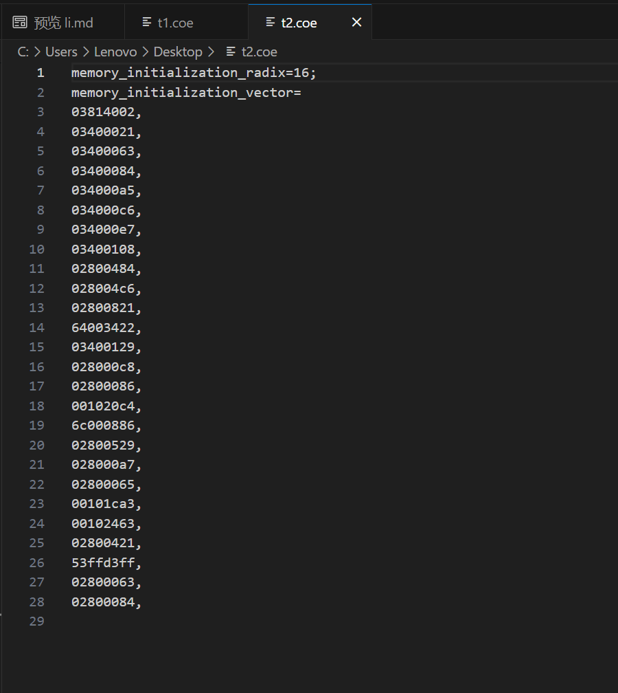

# Lab 1 report
**PB22051022 王嘉宁**
  
## 实验目的与内容 
> 熟悉 RISC 指令集（龙芯 LA32R 指令集以及 RV32I 指令集）的部分指令及编码格式，以便后续在硬件层面上实现这些指令。
## 逻辑设计
> 任务 1：斐波那契数列  

    li.w $r2, 9
    andi $r1, $r1, 0
    andi $r3, $r3, 0
    andi $r4, $r4, 0
    andi $r5, $r5, 0
    addi.w $r3, $r3, 1
    addi.w $r4, $r4, 1
    addi.w $r1, $r1, 2
    a: 
    bge $r1, $r2, exit
    addi.w $r5, $r4, 0
    addi.w $r4, $r3, 0
    add.w $r3, $r4, $r5
    addi.w $r1, $r1, 1
    b a
    exit: 
    addi.w $r3, $r3, 0

> 任务 2：大整数处理  

    li.w $r2, 80
    andi $r1, $r1, 0
    andi $r3, $r3, 0
    andi $r4, $r4, 0
    andi $r5, $r5, 0
    andi $r6, $r6, 0
    andi $r7, $r7, 0
    andi $r8, $r8, 0
    addi.w $r4, $r4, 1
    addi.w $r6, $r6, 1
    addi.w $r1, $r1, 2
    a: 
    bge $r1, $r2, exit
    andi $r9, $r9, 0
    addi.w $r8, $r6, 0
    addi.w $r6, $r4, 0
    add.w $r4, $r6, $r8
    bgeu $r4, $r6, m
    addi.w $r9, $r9, 1
    m:
    addi.w $r7, $r5, 0
    addi.w $r5, $r3, 0
    add.w $r3, $r5, $r7
    add.w $r3, $r3, $r9
    addi.w $r1, $r1, 1
    b a
    exit: 
    addi.w $r3, $r3, 0
    addi.w $r4, $r4, 0

## 结果与分析

> 任务 1：斐波那契数列  
> 

> 任务 2：大整数处理  
> 

> 任务 3：导出 COE 文件  
> 任务一
> 
> 任务二
> 

## 总结
>  对龙芯 LA32R 指令集部分指令及编码格式有所熟悉，并掌握了一些使用软件基本技巧。